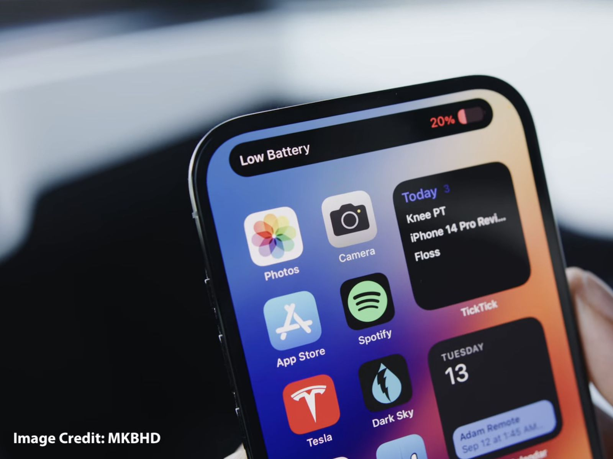

# We  are over stimulated

[Return](./index.md) | [Home](../index.md) | Created 26/08/2024 by [theluqmn](https://github.com/theluqmn), in Kuala Lumpur, Malaysia.

## A dive into how modern technology has disconnected us from the moment, and ourselves

In recent months, I have been experiencing some form of detachment from the world, and myself. Things that I used to enjoy, I no longer do. I have been feeling tired, and not motivated to do anything. Not wanting this to last any longer, and with a little spark of curiosity, I started to research this topic.

Whilst writing this, I was in a 5 day challenge of no social media and limited internet. I got rid of my phone and limited usage of my laptop to only researching and writing topics related to this article. YouTube, can only be accessed through my TV.

### Huh? What?

Feeling lost? Anxiety? Disinterest? Tiredness? You are not alone. A UNICEF [blog post](https://www.unicef.org/rosa/blog/we-are-stressed-and-we-are-overwhelmed) from 11 October 2023 mentioned that in a UNICEF and Gallop survey of 21 countries, roughly 1 in 5 young people aged 15 to 24, said they often feel depressed and having little to no interest in doing things.

It is obvious that our modern day technology has made an impact to our health in general, but more specifically, mental health.

### A quick look into dopamine

Dopamine is a type of neurotransmitter and acts as a chemical messenger in the brain. It also acts as hormone, often referred to as the "feel good" hormone. Dopamine is part of the body's reward system, and is responsible for rewarding our brain when pleasurable things happen - like eating, drinking, sex, achieving goals, and more.

### Constant stream of information

In the inboxes and feeds of our social media apps, emails and homepages of search engines, it is as if the world is shoving down a ton of information on us. The tech overlords wants our attention - **so bad**, they are probably as desperate as your secret crush (*chances are if you are reading this, you have none, so try to imagine*). They designed advanced **algorithms** and **machine learning models** to suggest and show you the things you like, that rewards you with dopamine, so you stick on their apps/platforms longer. To be honest, those things work only when you are in the trap, and notifications are really the culprit - it lures you in. The more you spend time, the more likely you are to spend, watch ads, and prioritise this in your daily life. It is all a fact and is proven, at least for social media.

There are always something new to offer, everywhere! Ads on new shoes, posts on new cars, games and whatever your friends bought, a politican pushing for another agenda that nobody literally asked for, another war, another crisis, I think you got it by now.

Notifications and alerts, "low battery" is a notable one, puts us on high alert and triggers a release of adrenaline, norepinephrine and cortisol. The chemicals are designed to keep us on high alert, and ready to defend ourselves, but when we are not in harm, it makes us feel like we are on an edge.

### Unlimited choices and possibilies

The internet, has opened the gate to discover unlimited possibilities and make endless choices. It has allowed for some to reach new heights in their career, academics, and life. The same however, could not be said for most of us.

All these options makes it hard to settle on one and stick to it. During the writing of this post, I have tried countless programming languages to settle with, Python, Ruby, JavaScript, C, Go, and more for over a **year**. It was only recently, that I settled with Go for compiled, Python for general and JavaScript for frontend (I have not taken frontend seriously still). Trying out different things and picking out the ones that suits you is a good habit to have, but oh god, the times I have spent taking things seriously only to then discover that is game-changing? Countless times.

### The digital world fosters comparison

Most of us took part and played a role in the **constant stream of information** by sharing the things **we** want to share. As humans, you want others to look at the best of you, the best of what you do, and the best of what you have - hence, the tendency to share online whatever hipster drink you bought, the places you are at, and whatever your just won or achieved.

"This month I made x dollars with my startup". "I gained 15k followers this year". "Cool place I'm in" (picture below)

Listen. Competition drives innovation, however, what most forgot to put in mind is that it brings along **jealousy**. Jealousy is dangerous. For some, it creates hate and a negative perception, whilst for most, it creates anxiety and depression. "I am so dumb" is something that we unfortunately hear quite often in our daily life.

### How do we get out of this?

I have to be real with this one. Most of these are not going anywhere. These technologies, despite the cons, also have its own set of pros and benefits. It is like a knife. It can be used to cut food, but it can also be used to stab someone to death.

We, as the consumers and humans, with our moral and ethical values, have the power to decide what we want to do about it. In my opinion, most of these issues occur due to lack of awareness and education. We blindly followed the trends, the hype. We are not taught to think critically, and to question the things we see.

Here are some steps that I figured out and implemented in my life:

- 1. **Limit your screentime**. Instagram has this feature to remind you to take a break, which I enabled and recommend others to do so. For mine, I made it remind me every 10 minutes. Alright I will be honest, despite having it turned on, I still mostly ignored it but it makes me aware of how long I have been on the app.
- 2. **Disable notifications for the things you do not need to know about**. Just visited a website and it asked to allow notifications? Say no. I disabled all notifications from the social media apps I use on my phone a few months ago, and now I literally do not have the tendency to check things out until I am free, with all my work finished. To be honest, most of the notifications are really annoying at most times, so why not?
- 3. **Be mindful**. Live in the moment, and be grateful for what you are, and what you have. Be present. Enjoy it. My teacher in grade 5 made us keep a mindfulness journal, and that was early in the Covid era so it helped a lot.
- 4. **Think before you share**. Careful of what you say, share, and post online - it leaves an everlasting digital footprint. Think twice before sharing that fire picture of yours, as you may attract unwanted attention on yourself.
- 5. **Keep track of what you are doing, and what's next**. Find a purpose, set goals to fulfill that purpose, and work towards achieveing said goals. Find motivation, then discipline yourself to do what you need to do. This is one of hardest ones, even I am still struggling, but let's keep our hopes high and keep trying.

### Further reading

Thank you for reading this far, and I hope this post has helped you in some way. It is my first one, and I will definitely be writing more in the future! If you are interested in reading more regarding this topic, here are some of my recommendations:

- [The Psychology of your scrolling addiction](https://hbr.org/2022/01/the-psychology-of-your-scrolling-addiction)
- [Stress and anxiety in the digital age: the dark side of technology](https://www.open.edu/openlearn/health-sports-psychology/mental-health/stress-and-anxiety-the-digital-age-the-dark-side-technology)
- [What is a recommendation engine?](https://www.ibm.com/think/topics/recommendation-engine)

----

I referred to the following articles for some inspiration and sources:

- [Fortune](https://fortune.com/well/2023/05/04/technology-mental-health-effects-digital-distress/)
- [Unicef](https://www.unicef.org/rosa/blog/we-are-stressed-and-we-are-overwhelmed)

This post is writen myself, with own thoughts and opinions. AI was only used to find websites and articles to read and reference.
